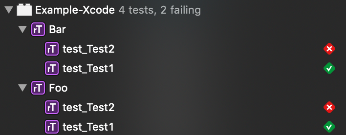
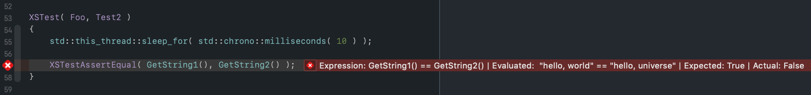

XSTest
======

[](https://travis-ci.com/macmade/XSTest)
[](https://ci.appveyor.com/project/macmade/XSTest)
[](https://coveralls.io/r/macmade/XSTest?branch=master)
[](https://github.com/macmade/XSTest/issues)


[](https://twitter.com/macmade)  
[](https://patreon.com/macmade)
[](https://www.gratipay.com/macmade)
[](https://paypal.me/xslabs)

About
-----

**XSTest is a cross-platform C++ unit testing library.**

### Features

 - Cross-platform (macOS, Windows, Linux, Unix)
 - C++11 and greater
 - Header-only library
 - Integration with IDEs such as Xcode and VisualStudio
 - Compatible with GoogleTest


### Primer

XSTest is a header only library, meaning you simply need to include `XSTest/XSTest.hpp` in order to use-it.

Test cases are defined using the `XTest` macro.  
Parameters are the test suite name and the test case name:

```cpp
#include <XSTest/XSTest.hpp>

XSTest( MyTestSuite, MyTestCase )
{
    /* Test case body */
}
```

Note that tests cases and test suites are run in random order for each invocation.

#### Assertions

Test case body is user-defined code, but the test case result is controlled using assertions macros:

```cpp
#include <XSTest/XSTest.hpp>

XSTest( MyTestSuite, MyTestCase )
{
    XSTestAssertTrue( true );         /* Will succeed */
    XSTestAssertEqual( true, false ); /* Will fail */
}
```

#### Main function

Usually, the unit tests are packaged into an executable.  
You can define a `main` function that will run all registered tests using:

```cpp
#include <XSTest/XSTest.hpp>

int main( int argc, char * argv[] )
{
    return XS::Test::RunAll( { argc, argv } );
}
```

As an alternative, you can define the `XSTEST_MAIN` macro.  
This will automatically generate a `main` function for you.
```cpp
#define XSTEST_MAIN
#include <XSTest/XSTest.hpp>
```

#### Fixtures

XSTest supports _fixtures_, that is test cases that will run from a user defined class representing the test suite.  
This allows custom setup to be performed prior to running a test case.

Fixtures requires a user-defined class, inheriting from `XS::Test::Case`, and are defined with the `XSTestFixture` macro:

```cpp
#include <XSTest/XSTest.hpp>

class MyFixture: XS::Test::Case
{
    protected:
        
        void SetUp() override
        {
            this->_x = 42;
        }
        
        void TearDown() override
        {}
        
        int _x = 0;
};

XSTestFixture( MyFixture, MyTestCase )
{
    XSTestAssertEqual( this->_x, 42 ); /* Will succeed */
}
```

For each test case, a new instance of the fixture class will be created.  
`SetUp` and `TearDown` will be automatically called, allowing you to add custom behaviours to your test suite.

#### Running selected tests

When XSTest is run as an executable, you can specify which test you want to run by providing the names as command-line arguments:

```sh
./MyTestExecutable Foo Bar.Test1 Bar.Test2
```

In the example above, all tests from the `Foo` suite will run, as well as `Test1` and `Test2` from the `Bar` suite.

### IDE Integration

#### Xcode

XSTest provides a bridge for Xcode's XCTest framework, allowing you to run your tests and see the results directly from Xcode.



In order to use XSTest within Xcode, simply create a unit-test bundle and link with `XSTest.framework`, which is provided by the `XSTest.xcodeproj` project.

Then, write your tests as usual, including XSTest's main header file:

```cpp
#include <XSTest/XSTest.hpp>
```

Note that in such a scenario, there's no need for a `main` function.

You can then run your tests. Test results will be reported to Xcode and displayed as usual:



#### VisualStudio

...

### GoogleTest Compatibility

XSTest aims to be compatible with GoogleTest, making it easy to migrate.

Most assertions from GoogleTest can be used seamlessly with XSTest, by defining the `XSTEST_GTEST_COMPAT` macro:

```cpp
#define XSTEST_GTEST_COMPAT
#include <XSTest/XSTest.hpp>

TEST( MyTestSuite, MyTestCase )
{
    ASSERT_TRUE( true );
}
```

Supported macros are:


GoogleTest:                | Expands to:
-------------------------- | ------
`TEST`                     | `XSTest`
`TEST_F`                   | `XSTestFixture`
`ASSERT_TRUE`              | `XSTestAssertTrue`
`ASSERT_FALSE`             | `XSTestAssertFalse`
`ASSERT_EQ`                | `XSTestAssertEqual`
`ASSERT_NE`                | `XSTestAssertNotEqual`
`ASSERT_LT`                | `XSTestAssertLess`
`ASSERT_LE`                | `XSTestAssertLessOrEqual`
`ASSERT_GT`                | `XSTestAssertGreater`
`ASSERT_GE`                | `XSTestAssertGreaterOrEqual`
`ASSERT_STREQ`             | `XSTestAssertStringEqual`
`ASSERT_STRNE`             | `XSTestAssertStringNotEqual`
`ASSERT_STRCASEEQ`         | `XSTestAssertStringEqualCaseInsensitive`
`ASSERT_STRCASENE`         | `XSTestAssertStringNotEqualCaseInsensitive`
`ASSERT_THROW`             | `XSTestAssertThrow`
`ASSERT_NO_THROW`          | `XSTestAssertNoThrow`
`ASSERT_ANY_THROW`         | `XSTestAssertAnyThrow`
`ASSERT_FLOAT_EQ`          | `XSTestAssertFloatEqual`
`ASSERT_DOUBLE_EQ`         | `XSTestAssertDoubleEqual`
`ASSERT_HRESULT_SUCCEEDED` | `XSTestAssertHResultSucceeded`
`ASSERT_HRESULT_FAILED`    | `XSTestAssertHResultFailed`

### Documentation

#### Comparison assertions

Assertion                                    | Verifies
-------------------------------------------- | ----------------
`XSTestAssertTrue( expr )`                   | `expr == true`
`XSTestAssertFalse( expr )`                  | `expr == false`
`XSTestAssertEqual( expr1, expr2 )`          | `expr1 == expr2`
`XSTestAssertNotEqual( expr1, expr2 )`       | `expr1 != expr2`
`XSTestAssertLess( expr1, expr2 )`           | `expr1 < expr2`
`XSTestAssertLessOrEqual( expr1, expr2 )`    | `expr1 <= expr2`
`XSTestAssertGreater( expr1, expr2 )`        | `expr1 > expr2`
`XSTestAssertGreaterOrEqual( expr1, expr2 )` | `expr1 >= expr2`

#### C string comparison assertions

Assertion                                                   | Verifies
----------------------------------------------------------- | --------------------------------------------------
`XSTestAssertStringEqual( expr1, expr2 )`                   | If both C strings are equal (case sensitive)
`XSTestAssertStringNotEqual( expr1, expr2 )`                | If both C strings are not equal (case sensitive)
`XSTestAssertStringEqualCaseInsensitive( expr1, expr2 )`    | If both C strings are equal (case insensitive)
`XSTestAssertStringNotEqualCaseInsensitive( expr1, expr2 )` | If both C strings are not equal (case insensitive)

#### Exception assertions

Assertion                           | Verifies
------------------------------------| -------------------------------------------------
`XSTestAssertThrow( expr, except )` | If `expr` throws a C++ exception of type `except`
`XSTestAssertNoThrow( expr )`       | If `expr` doesn't any C++ exception
`XSTestAssertAnyThrow( expr )`      | If `expr` throws a C++ exception

#### Floating point comparison assertions

Assertion                                 | Verifies
------------------------------------------| -----------------------------------------------
`XSTestAssertFloatEqual( expr1, expr2 )`  | If both `float` values can be considered equal
`XSTestAssertDoubleEqual( expr1, expr2 )` | If both `double` values can be considered equal

*Note: Floating point values are considered equal if they are within 4 ULPs from each other.*  
*Value of 4 ULPs is used to keep compatibility with GoogleTest, which uses the same value.*

#### Windows specific assertions

Assertion                              | Verifies
---------------------------------------| -------------------------------------------------
`XSTestAssertHResultSucceeded( expr )` | If `expr` is a valid `HRESULT`
`XSTestAssertHResultFailed( expr )`    | If `expr` is not a valid `HRESULT`

License
-------

XSTest is released under the terms of the MIT license.

Repository Infos
----------------

    Owner:          Jean-David Gadina - XS-Labs
    Web:            www.xs-labs.com
    Blog:           www.noxeos.com
    Twitter:        @macmade
    GitHub:         github.com/macmade
    LinkedIn:       ch.linkedin.com/in/macmade/
    StackOverflow:  stackoverflow.com/users/182676/macmade
